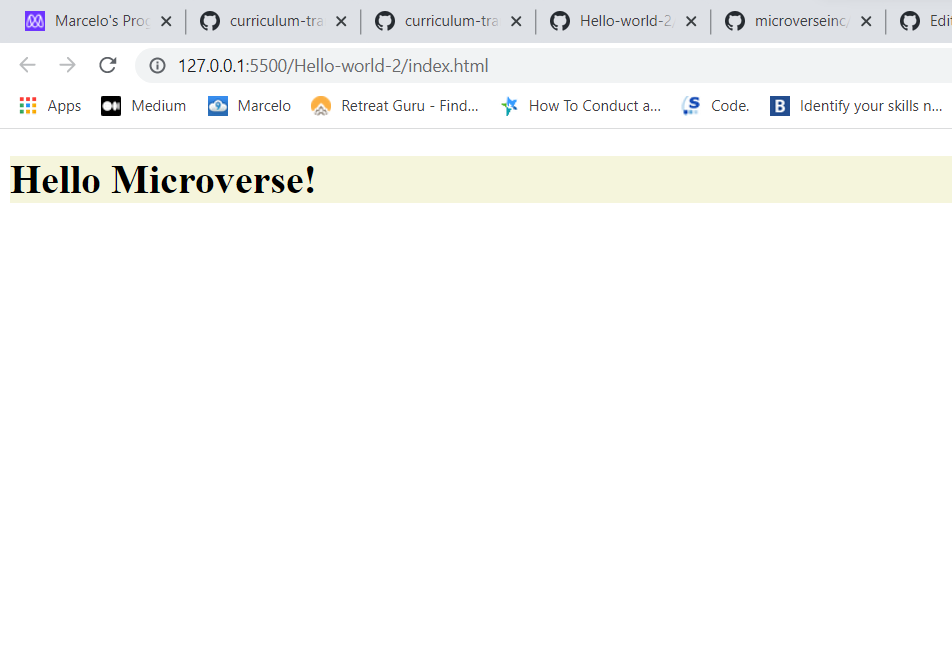

# Hello World Project

> Project created to master the tools required to setiing up a project in Github

This project use the basic tools for the first steps of code reviews in Microverse

## Built With

- HTML
- CSS
- Linter

## Author

👤 **Author**

- GitHub: [@marcelosdata](https://github.com/marcelosdata)
- Twitter: [@marcelo90](https://twitter.com/marcelo90)
- LinkedIn: [msn9](https://www.linkedin.com/in/msn9)

## 🤝 Contributing

Contributions, issues, and feature requests are welcome!

## Acknowledgments

- Coding Partner Nicolas